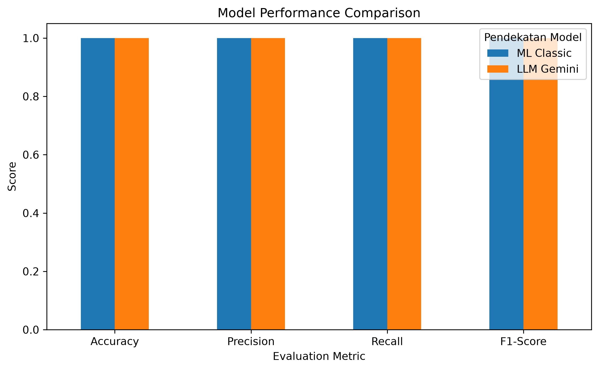

# AI Model Experiment & Evaluation

Proyek ini berisi eksperimen dan evaluasi dua pendekatan AI untuk melakukan klasifikasi sentimen ulasan pelanggan, yaitu Machine Learning klasik menggunakan TF-IDF + Logistic Regression dan Large Language Model (LLM) Gemini API. Kedua pendekatan dievaluasi menggunakan test set yang sama agar hasil perbandingannya adil.

## 1. Problem Statement

**1) objective**

Membandingkan dua pendekatan AI untuk mengklasifikasikan sentimen berupa positif dan negatif secara otomatis dari ulasan pelanggan. Pendeketan tersebut antara lain model Machine Learning klasik menggunakan Scikit-learn dan LLM Gemini melalui API. Hasil prediksi digunakan untuk membandingkan performa dan trade-off dari kedua pendekatan.

**2) target/label**

Kategori sentimen dari ulasan pelanggan, yaitu positif dan negatif.

**3) atasan/asumsi**

- klasifikasi dibatasi pada dua kelas sentimen seseuai dengan sentimen dari dataset.
- kedua pendekatan dievaluasi menggunakan test set yang sama agar perbandingan adil.
- Asumsi: output teks dari Gemini API bisa saja bervariasi (seperti penggunaan huruf kapital dan spasi tambahan), sehingga perlu dilakukan pembersihan berupa penghapusan whitespace dan penyesuaian huruf kecil untuk memastikan konsistensi format data dengan label acuan saat perhitungan metrik evaluasi.

## 2. Sumber Dataset

Dataset yang digunakan adalah dataset ulasan pelanggan e-commerce disertai sentimennya.

**File:** `customer_reviews_sentiment.csv`

**Lokasi:** `./data/customer_reviews_sentiment.csv`

## 3. Struktur Folder Project

Pastikan struktur folder project sesuai dengan path yang digunakan pada notebook:

```text
model-experiment-assignment/
├── data/
│   └── customer_reviews_sentiment.csv
├── notebook/
│   └── experiment_notebook.ipynb
├── documentation/
│   └── model_comparison_summary.png
├── README.md
└── requirements.txt
```

## 4. Pendekatan 1 — Machine Learning Klasik

Pendekatan pertama menggunakan:

- TF-IDF sebagai feature extraction untuk mengubah teks menjadi representasi numerik.
- Logistic Regression sebagai model klasifikasi.

### Alur Model Klasik

```text
Review Text
    ↓
TF-IDF Vectorization
    ↓
Logistic Regression
    ↓
Prediksi Sentimen
    ↓
Positif / Negatif
```

## 5. Pendekatan 2 — LLM Gemini API

Pendekatan kedua menggunakan Gemini API dengan teknik zero-shot prompting.

Zero-shot prompting digunakan karena tugas yang dikerjakan berupa klasifikasi sentimen dari sebuah review text ke dalam kategori positif atau negatif. Tugas ini memiliki instruksi yang sederhana dan jelas serta dapat dipahami oleh LLM melalui kemampuan pemahaman semantik terhadap konteks ulasan. Oleh karena itu, pemberian contoh tambahan seperti pada few-shot prompting belum diperlukan.

### Contoh format prompt

```text
Klasifikasikan sentimen ulasan berikut sebagai "positif" atau "negatif".
Jawab hanya dengan satu kata: positif atau negatif.

Ulasan: "<review_text>"
Sentimen:
```

### Parameter yang digunakan

- temperature = 0.2

Temperature rendah dipilih karena task berupa klasifikasi sehingga dibutuhkan output yang lebih konsisten dan tidak terlalu variatif.

Hasil prediksi Gemini kemudian dinormalisasi menjadi label positif atau negatif agar konsisten dengan label pada dataset.

## 6. Evaluasi dan Perbandingan Model

Kedua pendekatan dievaluasi menggunakan:

- Accuracy
- Precision
- Recall
- F1-Score
- Confusion Matrix

### Ringkasan Hasil Evaluasi

| Metric    | ML Classic | LLM Gemini |
|-----------|-----------:|-----------:|
| Accuracy  |       1.00 |       1.00 |
| Precision |       1.00 |       1.00 |
| Recall    |       1.00 |       1.00 |
| F1-Score  |       1.00 |       1.00 |

### Interpretasi

Berdasarkan hasil evaluasi, ML Classic dan LLM Gemini memperoleh nilai Accuracy, Precision, Recall, dan F1-Score sebesar 1.0 atau 100%. Hal ini menunjukkan bahwa kedua pendekatan mampu mengklasifikasikan seluruh data pada test set dengan benar. Nilai Precision dan Recall sebesar 100% juga menunjukkan bahwa tidak terdapat kesalahan prediksi berupa false positive maupun false negative pada kelas positif, sedangkan nilai F1-Score sebesar 100% menunjukkan kedua pendekatan sama-sama optimal dan seimbang.

### Visualisasi perbandingan performa model



## 7. Analisis Trade-off dan Limitation

Berdasarkan hasil eksperimen, model ML klasik dan LLM Gemini API menunjukkan performa yang sama pada test set, dengan Accuracy, Precision, Recall, dan F1-Score sebesar 100%. Oleh karena itu, pada eksperimen ini belum terdapat perbedaan performa yang signifikan antara kedua pendekatan. Dari sisi effort implementasi, ML klasik membutuhkan proses preprocessing menggunakan TF-IDF dan training Logistic Regression untuk mempelajari pola dari data training, sedangkan Gemini dapat langsung melakukan klasifikasi melalui prompt tanpa proses training. Dari sisi kecepatan, ML klasik lebih cepat pada eksperimen ini karena dataset yang digunakan relatif kecil, yaitu 160 data training dan 40 data testing, serta proses training dan inference dapat dilakukan langsung pada CPU laptop. Gemini API cenderung lebih lambat karena setiap prediksi memerlukan komunikasi melalui API sehingga terdapat network latency serta batas request seperti RPM pada free tier. Dari sisi biaya, ML klasik relatif murah karena setelah model dilatih, prediksi dapat dilakukan secara lokal tanpa biaya per request, sedangkan Gemini API memiliki potensi biaya berdasarkan jumlah request dan token yang digunakan jika penggunaan meningkat. Keterbatasan ML klasik adalah kemampuan memahami konteks semantik yang lebih terbatas karena TF-IDF lebih berfokus pada pola kata, sehingga dapat mengalami kesulitan pada kalimat yang lebih kompleks, ambigu, atau memiliki konteks tertentu. Sementara itu, Gemini memiliki kemampuan pemahaman bahasa yang lebih baik dan tidak memerlukan training khusus, tetapi memiliki ketergantungan terhadap koneksi internet, layanan API, rate limit, latency, serta potensi biaya penggunaan. Sehingga, pada studi kasus dalam eksperimen di atas, penggunaan ML Klasik lebih unggul dari sisi efisiensi implementasi, kecepatan inference, dan biaya, karena mampu mencapai performa evaluasi yang sama dengan Gemini tanpa ketergantungan pada API. Namun, jika ulasan pelanggan mulai lebih kompleks, ambigu, dan berdasarkan konteks tertentu atau membutuhkan pemahaman makna yang lebih mendalam, maka LLM Gemini API dapat menjadi pendekatan yang lebih sesuai karena memiliki kemampuan pemahaman semantik dan konteks bahasa yang lebih baik dibandingkan pendekatan TF-IDF dan Logistic Regression.

## 8. Rekomendasi Technical Approach

Berdasarkan hasil eksperimen, ML Klasik menggunakan TF-IDF dan Logistic Regression direkomendasikan sebagai pendekatan utama untuk studi kasus ini. Kedua pendekatan, yaitu ML Klasik dan LLM Gemini API, memperoleh Accuracy, Precision, Recall, dan F1-Score sebesar 100%, sehingga dari sisi performa keduanya memberikan hasil yang sama pada test set yang digunakan. Namun, ML Klasik lebih efisien dari sisi kecepatan inference dan biaya karena proses prediksi dapat dilakukan secara lokal tanpa ketergantungan pada koneksi internet, API, rate limit, maupun biaya penggunaan per request. Selain itu, model yang digunakan relatif ringan sehingga dapat dijalankan menggunakan CPU pada laptop untuk dataset dengan skala seperti pada eksperimen ini. Namun, apabila ke depannya karakteristik ulasan menjadi lebih kompleks maka pendekatan berbasis LLM seperti Gemini API dapat dipertimbangkan karena memiliki kemampuan pemahaman konteks bahasa yang lebih baik dibandingkan pendekatan TF-IDF. Dengan demikian, untuk kebutuhan saat ini ML Klasik lebih sesuai dari sisi efisiensi dan performa, sedangkan LLM dapat dipertimbangkan ketika kompleksitas data dan disaat kasus dengan pemahaman bahasa meningkat.

## 9. Cara Menginstal Dependency

### Buat Virtual Environment

```bash
python -m venv .venv
```

### Aktifkan Virtual Environment pada Windows

```bash
.venv\Scripts\activate
```

### Install Dependency

```bash
pip install -r requirements.txt
```

### Isi `requirements.txt`

```text
pandas
scikit-learn
google-genai
python-dotenv
jupyter
ipykernel
```

### Konfigurasi Gemini API

Buat file `.env` pada root project:

```text
GEMINI_API_KEY=YOUR_API_KEY
```

```python
api_key = os.getenv("GEMINI_API_KEY")
```

## 10. Cara Menjalankan Experiment Notebook

Pastikan terminal berada pada root folder project, aktifkan virtual environment, kemudian jalankan:

```bash
jupyter notebook
```

Buka:

```text
notebook/experiment_notebook.ipynb
```

Kemudian jalankan cell notebook secara berurutan.

### Alur Eksperimen

```text
               Dataset Ulasan Pelanggan
                        ↓
               Load & Inspect Dataset
                        ↓
                Train/Test Split
                        ↓
        ┌───────────────────────────────┐
        ↓                               ↓
ML Classic                         LLM Gemini
TF-IDF                             Zero-shot Prompt
        ↓                               ↓
Logistic Regression                Gemini API
        ↓                               ↓
Prediksi Sentimen                  Prediksi Sentimen
        └───────────────┬───────────────┘
                        ↓
                    Evaluation
                        ↓
        Accuracy, Precision, Recall, F1-Score
                        ↓
               Trade-off Analysis
                        ↓
             Technical Recommendation
```
